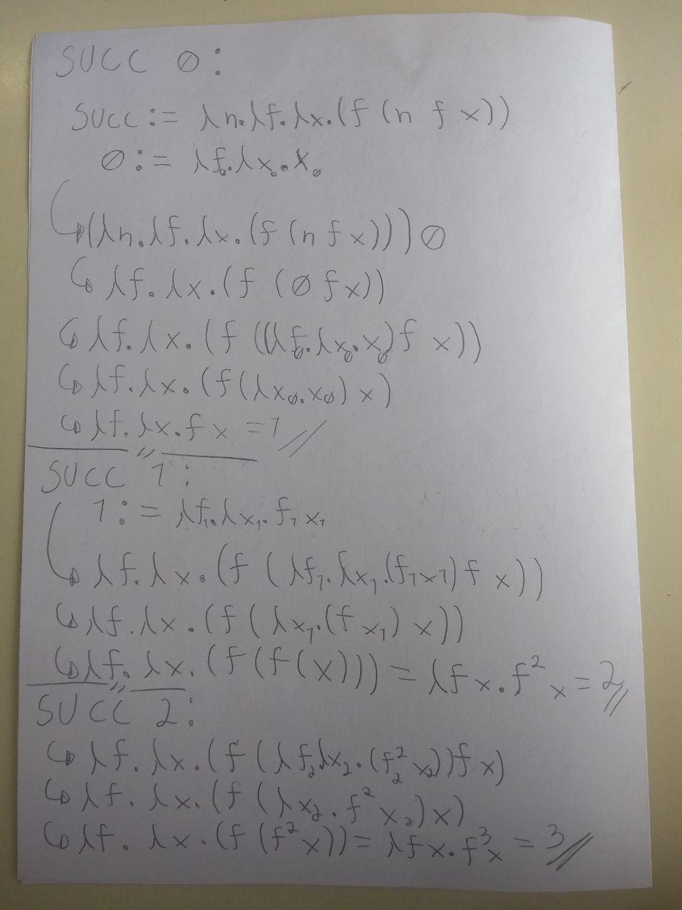
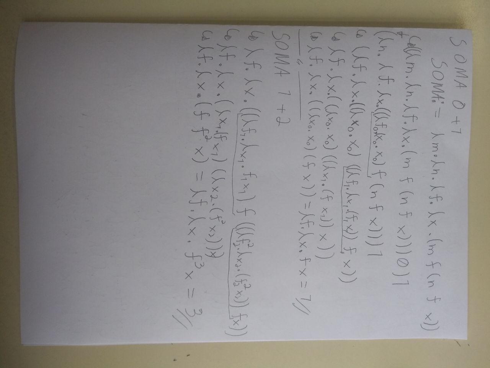
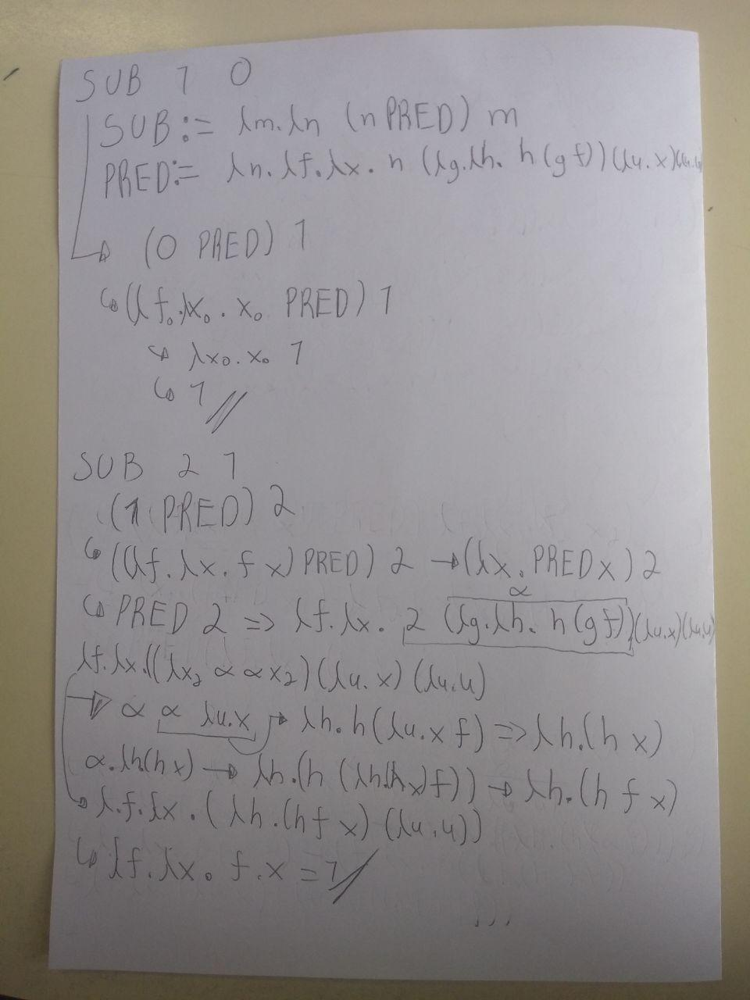

# Exercício 1
**a)** A = f(X) = x⁴ + 4

        λx : (x⁴ + 4)

**b)** B = f(a, b) = a + b

        λ a, b: a + b

**c)** C= f(x) = x^(-2)

        λx : x**(-2)
        
**d)** D = f(x) = x * x^(-1)

        λx : x * x^(-1)     (λx : 1, para todo x ≠ 0)

# Exercício 2

**a)** xy == yx

        x e y são independentes em ambos os lados e as 
        funções não são alpha-equivalentes

**b)** λx.x(λy.xy) == λz.z(λx.zx)

        - λx.x(λy.xy) {z/x} -> λz.z(λy.zy)
        - λz.z(λy.zy) {x/y} -> λz.z(λx.zx)

        x, y e z são dependentes em ambas e as funções 
        são alpha-equivalentes

**c)** ((λx.x(λy.xyzy)x)xy) == ((λy.y(λz.yzwz)y)yx)

        - ((λx.x(λy.xyzy)x)xy) {y/x} -> ((λx.x(λy.xyzy)x){y/x} (x) {y/x} (y){y/x})
        - ((λx.x(λy.xyzy)x){y/x} (x) {y/x} (y){y/x}) -> ((λx.x(λy.xyzy)x){y/x} xy)
        - ((λx.x(λy.xyzy)x)[y -> y']{y/x} xy) -> ((λx.x(λy'.xy'zy')x){y/x} xy)
        - ((λy.y(λy'.yy'zy')y) xy) -> ((λy.y(λy'.yy'zy')y) xy){z/y'}
        - ((λy.y(λy'.yy'zy')y) xy){z/y'} -> ((λy.y(λy'.yy'zy')y) xy)[z -> z']{z/y'}
        - ((λy.y(λy'.yy'zy')y) xy)[z -> w]{z/y'} -> ((λy.y(λy'.yy'wy')y) xy){z/y'}
        - ((λy.(y(λy'.(yy'wy'))y)) xy){z/y'} -> ((λy.(y(λz.(yzwz))y)) xy)

        y e x da segunda e os últimos x e y da primeira são independentes, e enquanto
        as demais são dependentes. As funções não são alpha-equivalentes

# Exercício 3
        (x(λy.xy))[x→yz]

        - x[x->yz] (λy.xy)[x->yz] -> yz (λy.xy){w/y}[x->yz]
        - yz (λy.xy){w/y}[x->yz] -> yz (λw.xw)[x->yz]
        - yz (λw.xw)[x->yz] -> yz(λw.yzw)

# Exercício 4
**a)** (λx.(λy.y*y−(λz.z+x)4)3)2

        (λy.y*y-(λz.z+2)4)3
        3*3-(λz.z+2)4
        3*3-4+2
        9 - 4 + 2 = 7

**b)** (λx.x+ (λy.y*y)b)a

        (λx.(x+ (λy.y*y)b)a)
        a + (λy.y*y)b
        a + (b*b)
        a + b²

**c** (λx.(λy.x + (λx.8)−y)6)5
        (λy.5 + (λx.8)−y)6
        5 + (λx.8)−6
        5 + 8
        13

**d)** ((λx.(λy.x+y))3)7
        (λy.3+y)7
        (λy.3+y)7
        3 + 7
        10

# Exercício 5

**a)** (λx.+x1)

        (+x1)[x -> 2]
        + 2 1
        3

**b)** (λx.xx)(λx.xx)

        xx[x -> λx.xx]
        (λx.xx)(λx.xx)

**c)** (λx.x(xy))(λu.u)

        x(xy)[x -> (λu.u)]
        x[x -> (λu.u)] (xy)[x -> (λu.u)]
        (λu.u)(λu.u)y
        (λu.u) u[u -> y]
        (λu.u)y
        u[u -> y]
        y

**d)** (λy.(λx.y*y+x))z

        (λx.y*y+x)[y -> z]
        (λx.z*z+x)

**e)** (λx.((λy.(yx))(λi.i)))(λp.λq.p)

        (λx.((λy.(yx))(λi.i)))(λp.(λq.p))
        ((λy.(yx))(λi.i)) [x -> (λp.(λq.p))]
        (λy.(y(λp.(λq.p))))(λi.i)
        (y(λp.(λq.p))) [y -> (λi.i)]
        (λi.i)(λp.(λq.p))
        i [i -> (λp.(λq.p))]
        (λp.(λq.p))

**f)** (λx.x)((λy.(λx.xy))x)

        x [x -> ((λy.(λx.xy))x)]
        (λy.(λx.xy))x
        (λx.xy)[y -> x]
        λx.xx

**g)** (λx.xx)(λy.y)

        xx [x -> (λy.y)]
        (λy.y)(λy.y)
        y[y -> (λy.y)]
        λy.y

# Exercício 6

# Exercício 7

Representação para números inteiros:     

        n ≡ λf.λx. f^n x

Exemplos

        0 ≡ λf.λx. x
        1 ≡ λf.λx. f x
        2 ≡ λf.λx. f (f x) = λf.λx. f^2 x
        3 ≡ λf.λx. f (f(x)) = λf.λx. f^3 x
        4 ≡ λf.λx. f (f(f(x))) = λf.λx. f^4 x
        5 ≡ λf.λx. f (f(f(f(x)))) = λf.λx. f^5 x
        6 ≡ λf.λx. f (f(f(f(f(x))))) = λf.λx. f^6 x
        7 ≡ λf.λx. f (f(f(f(f(f(x)))))) = λf.λx. f^7 x
        8 ≡ λf.λx. f (f(f(f(f(f(f(x))))))) = λf.λx. f^8 x
        9 ≡ λf.λx. f (f(f(f(f(f(f(f(x)))))))) = λf.λx. f^9 x
        10 ≡ λf.λx. f (f(f(f(f(f(f(f(f(x))))))))) = λf.λx. f^10 x

# Exercício 8

O Combinador Y é uma forma de criar recursividade em funções anônimas, útil em cálculo lambda por uma função não precisar chamar a si mesma.

É basicamente uma função que recebe de argumentos uma função e um valor, e essa primeira função é passada junto de um argumento para uma segunda função que chama a primeira, passando a própria primeira como argumento. A primeira função tem o papel de parar a sequência ou de chamar a sia própria (recebida como argumento) novamente.